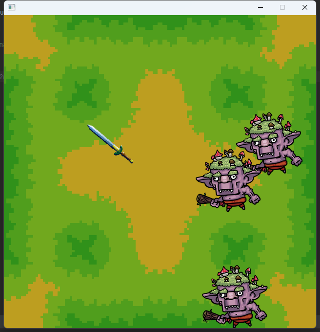

# gameByEbiten

使用 github.com/hajimehoshi/ebiten 开发的一款游戏demo

游戏的主要的思路来源于我在微信上看到的广告:   
玩家周围环绕着一把武器, 玩家通过移动来击杀敌人或打碎宝箱来使自己升级, 以获得更强力的装备。如果被比自己武器更强更长的敌人攻击, 则游戏结束, 有点类似大鱼吃小鱼。   
当然点进广告之后, 完全找不到宣传上的游玩方法😓, 正好看到了用go语言有个ebiten库, 用于游戏开发, 所以学习的同时写了个小demo   
ps: 作者完全没有学习过游戏开发, 仅靠网上找的教程和阅读源码, 很多用法也是试出来的,性能和可读性方面肯定还有很大的优化空间, 如果有什么不好或不对的地方, 请见谅

## 运行
`go run main.go`

## 截图

## TODO
1. 武器中间还没有找到合适的素材作为主角, 所以现在剑都是围绕着鼠标旋转的
2. 增加主角受击判断
3. 主角血量和分数显示
4. 游戏开始界面, 结束界面